# Fitcheck — AI Wardrobe & Virtual Try-On with Next.js, Clerk, Convex & Vercel Eve

[](https://nextjs.org/)
[](https://go.clerk.com/sonny)
[](https://www.convex.dev/)
[](https://vercel.com/)
[](https://platform.openai.com/)
[](https://react.dev/)
[](https://tailwindcss.com/)
[](https://www.typescriptlang.org/)

**Your clothes. New combinations. See the look on you.** Photograph a piece or an entire outfit, choose the items you actually want to keep, and turn them into a digital wardrobe. Build a look, ask your personal stylist for ideas, then preview it using your own photo.

Fitcheck brings together **image understanding, garment extraction, virtual try-ons, a contextual AI agent, realtime background jobs, authentication, subscriptions and a credit ledger** in one full-stack application.

[**Open the demo →**](https://fitcheck-eight-black.vercel.app) · [**Get started with Clerk →**](https://go.clerk.com/sonny) · [**Join the free AI Community →**](https://www.papareact.com/ztoh-form)

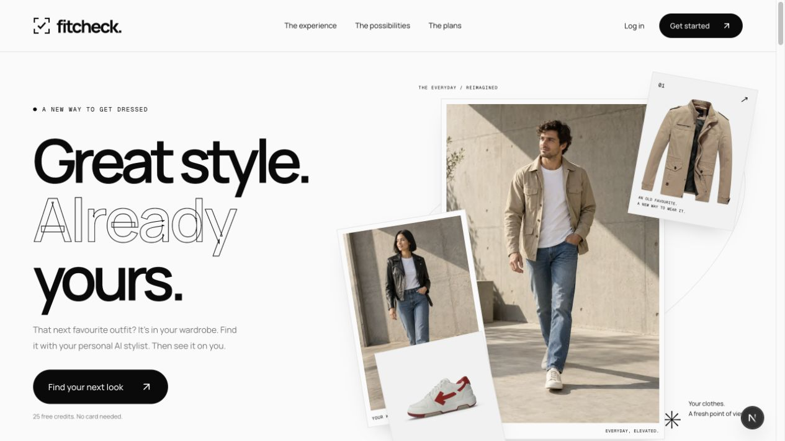

> **Who is this for?** Developers who want to build an AI product that does more than return a chat message. Follow an uploaded photo through detection, user confirmation, credit reservation, image generation, storage and a live interface. Then connect an agent to those same authenticated operations.

> **About the demo:** The hosted app uses a Clerk development instance and test-mode subscription checkout. AI calls can consume real provider funds. Try-ons are generated visual previews; they do not measure fit or guarantee an exact reproduction of a garment.

**This build uses:** Next.js **16.3.5**, React **19.2.8**, Clerk **7**, Convex **1.45**, Vercel Eve **0.56**, OpenAI SDK **7**, Tailwind CSS **4**, shadcn/ui with **Base UI**, Motion, TypeScript, Node **24+** and pnpm **10.28.0**. These describe this checkout; exact resolutions are in [`pnpm-lock.yaml`](pnpm-lock.yaml).

---

## 👇🏼 DO THIS Before You Get Started

1️⃣ Sign up to Clerk 👉 **[https://go.clerk.com/sonny](https://go.clerk.com/sonny)**

2️⃣ Create your Convex account 👉 **[https://www.convex.dev/](https://www.convex.dev/)**

3️⃣ Join my AI Community for FREE 👉 **[https://www.papareact.com/ztoh-form](https://www.papareact.com/ztoh-form)**

| Service               | Its job in Fitcheck                                              | Needed for                                               |
| --------------------- | ---------------------------------------------------------------- | -------------------------------------------------------- |
| **Clerk**             | Sign-in, sessions and user subscription plans                    | Authentication; enable Billing for plan synchronization  |
| **Convex**            | Database, file storage, reactive queries and durable workflows   | Wardrobe, outfits, credits and background jobs           |
| **Vercel AI Gateway** | Routes the stylist model; can also handle the image pipeline     | The stylist; optionally all AI requests                  |
| **OpenAI**            | Optional direct access for detection, image edits and embeddings | Use instead of Gateway for Convex AI actions             |
| **Vercel**            | Hosts Next.js and the Eve service                                | Deployment                                               |

The Clerk link above is Sonny’s campaign link. Set up your own service accounts and credentials when running your copy.

## 🧭 Inside This README

- [Features and screenshots](#features)
- [Architecture](#architecture)
- [From a photo to a wardrobe item](#photo-pipeline)
- [How virtual try-ons work](#try-ons)
- [The contextual AI stylist](#stylist)
- [Authentication, subscriptions and credits](#auth-and-credits)
- [Database and routes](#data-and-routes)
- [Getting started](#getting-started)
- [Demo walkthrough](#demo-walkthrough)
- [Testing and verification](#verification)
- [Deployment](#deployment)
- [Troubleshooting](#troubleshooting)
- [Take it further](#take-it-further)
- [Quick reference](#quick-reference)

---

<a id="features"></a>

## ✨ Features and Screenshots

### A wardrobe you can actually use

- Upload a single garment, a group photo or an outfit photo.
- Review the detected pieces **before** importing or spending extraction credits.
- Get separate product-style cutouts, clothing attributes and colour swatches.
- Search and filter by category, colour, season and formality.
- Edit tags, hide pieces, bulk-select items and track wear counts.
- Seed eight adult **men’s or women’s** demo pieces when you want to explore quickly.

Onboarding asks for a men’s or women’s wardrobe and a personal photo. The choice controls styling preferences and example clothes shown in the upload flow; it can be changed in Settings. Demo seeding asks for its own collection choice. Neither choice prevents you from importing other garments.

### Import the jacket, not everything in the photo

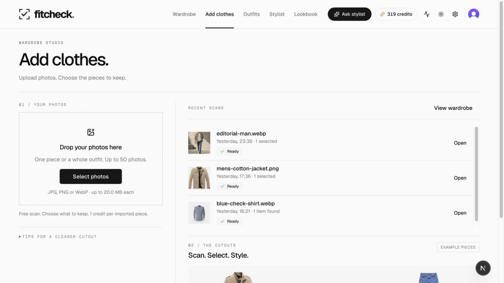

A scan finds potential clothing items. You choose which ones belong in your wardrobe. A picture showing a jacket, top, trousers and shoes does not automatically become four paid imports.

| Mobile wardrobe                                                                                      | Choose exactly what to import                                                                                    |
| ---------------------------------------------------------------------------------------------------- | ---------------------------------------------------------------------------------------------------------------- |
| 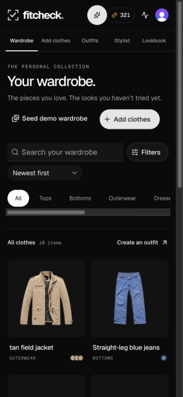 | 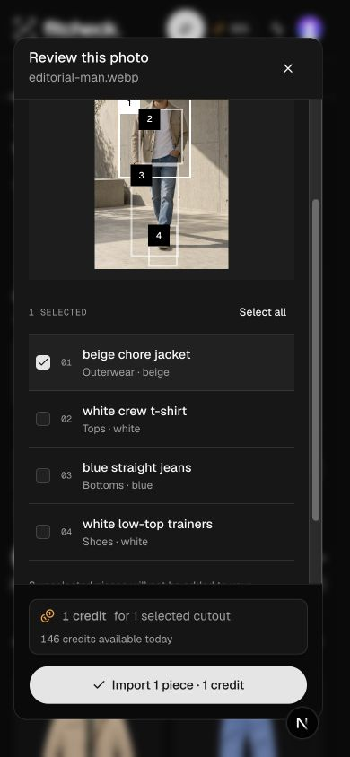 |

Scans awaiting review are grouped by source photo on **Add clothes** and **Wardrobe**. The selected count and credit cost are visible before confirmation. Discard a photo if none of its pieces are wanted.

### An outfit studio built around the result

The try-on is the main image. Switch between smaller render thumbnails, open the full-size viewer and edit the pieces alongside it on wider screens. Clothing cards expose clear replace/remove controls; the name, occasion and composition remain editable.

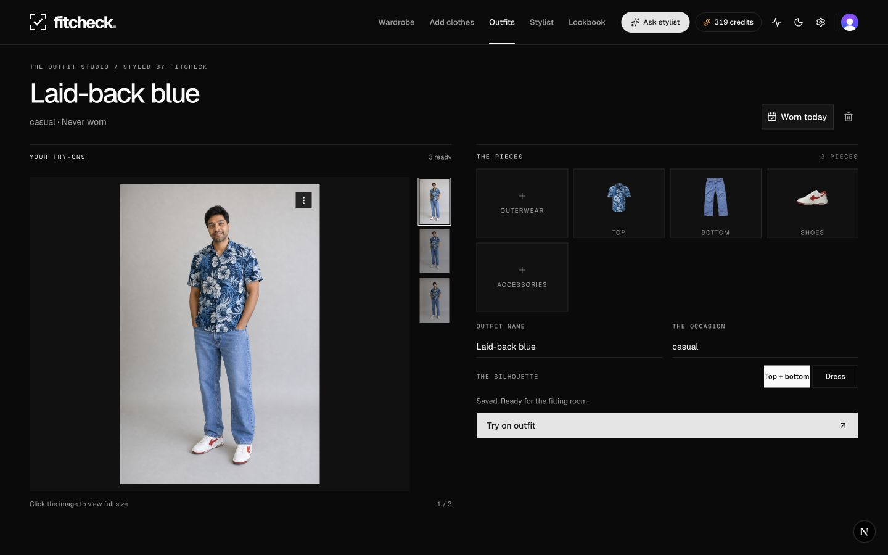

The builder supports **top + bottom** or **dress**, optional outerwear and shoes, and additional accessories. Marking an outfit worn updates its history and the participating pieces’ wear counts. Saved renders also appear in the Lookbook.

### A stylist that stays with you

Open **Ask stylist** from anywhere in the signed-in app. On desktop it sits beside your current page; on smaller screens it becomes a focused chat surface. Ask about the current item, selected clothes or the outfit you are editing.

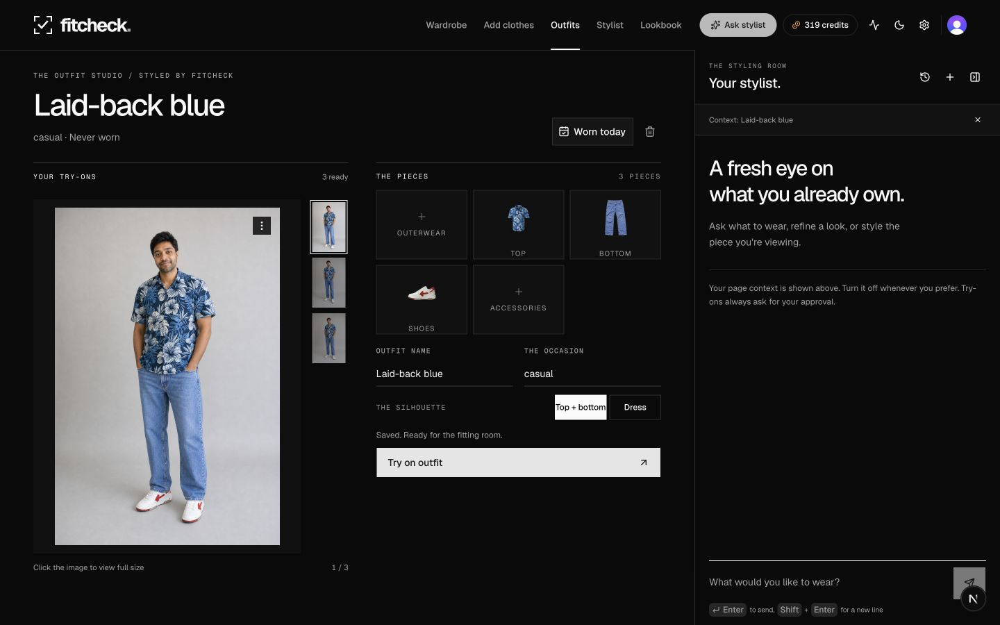

Tool activity is grouped into readable checks. Outfit proposals, clarification questions, credit approvals and live render cards have their own controls. You can keep drafting while a reply runs, stop a response and inspect what the tools actually did.

| Real tool activity                                                                                                                      | A completed try-on                                                                                                 |
| --------------------------------------------------------------------------------------------------------------------------------------- | ------------------------------------------------------------------------------------------------------------------ |
| 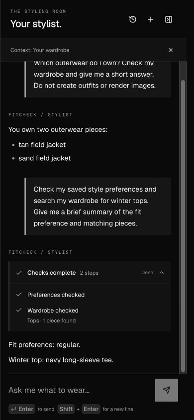 | 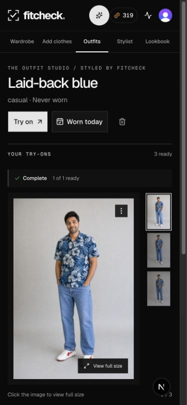 |

### Background work with useful progress

- File uploads show measured byte progress.
- AI jobs show actual phases: queued, scanning, preparing, creating, retrying and finishing.
- Ready, failed and skipped results are counted separately.
- Completion updates the render card and triggers a notification.
- Activity remains available while you move between pages.
- Failed work is settled and unused reserved credits are refunded.

AI generation does not report a meaningful percentage of an image completed. Fitcheck therefore uses job phases and result counts, with rounded historical duration guidance when available, instead of a countdown that gets stuck near zero.

The screenshots show real application screens and QA interactions, including actual AI outputs. See [capture provenance](docs/assets/README.md) for the source of each image. Mobile screenshots use responsive browser viewports, not a physical iPhone.

---

<a id="architecture"></a>

## 🔄 Architecture

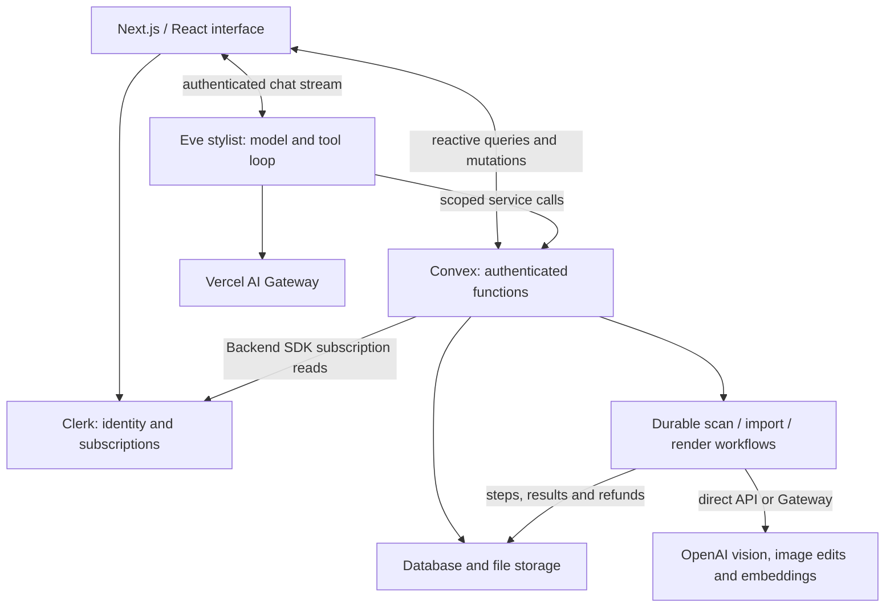

| Layer                     | Responsibility                                                                |
| ------------------------- | ----------------------------------------------------------------------------- |
| **Next.js**               | Routes, server-side route authentication and the responsive interface         |
| **Clerk**                 | Identity, sessions, active subscriptions and entitlements                     |
| **Convex**                | Owned application records, credits, storage and observable job state          |
| **Workflow component**    | Durable orchestration, action retries and completion callbacks                |
| **OpenAI image pipeline** | Detect garments, generate cutouts, create try-ons and embed item descriptions |
| **Eve**                   | Run the stylist conversation, invoke tools and wait for human approval        |

Two important boundaries keep this understandable:

1. **Clerk owns the subscription; Convex owns the credit ledger.** The app reads the subscription through the Clerk SDK. It does not mirror Clerk subscription events through webhooks.
2. **The agent uses the product’s backend.** It cannot skip ownership checks, invent a credit balance or write arbitrary database records. Its tools call scoped Convex functions.

---

<a id="photo-pipeline"></a>

## 📸 From a Photo to a Wardrobe Item

### 1. Upload the original

The client requests a Convex upload URL, uploads the file and registers the resulting storage reference. The batch supports up to **50 photos**, with a **20 MiB** limit per photo (shown as 20 MB in the interface). JPEG, PNG and WebP are supported; HEIC is not.

The original stays available for review and later re-extraction. Upload timeouts have retryable feedback rather than leaving the tile pending indefinitely.

### 2. Detect the candidates

`uploads.createBatch` starts a `scanUpload` workflow per photo. The vision call uses **`gpt-5-mini`** with a strict JSON schema. Each candidate includes:

- A short name, category and subcategory.
- Primary/secondary colours, pattern and a material guess.
- Seasons and formality.
- A normalized bounding box and a description that identifies the piece in the original photo.

Detection returns at most **12 candidates per photo**. Material and other visual attributes are model estimates, which you can correct later.

A successful scan stores the candidates and sets the upload to `awaiting_selection`. It creates **no wardrobe items and reserves no credits** at this stage. “Free scan” means no user credits are charged; the provider call still has a cost to the app operator.

### 3. Confirm what belongs in the wardrobe

`uploads.confirmSelection` receives the upload ID and selected candidate indices. It checks ownership, valid unique indices, wardrobe capacity and the available credit allowance.

Only confirmed candidates become item rows. Repeating the same confirmation is idempotent; submitting a different selection after confirmation is rejected. If the balance changes before all selected pieces can be processed, remaining pieces can wait in `needsCredits` and be resumed later.

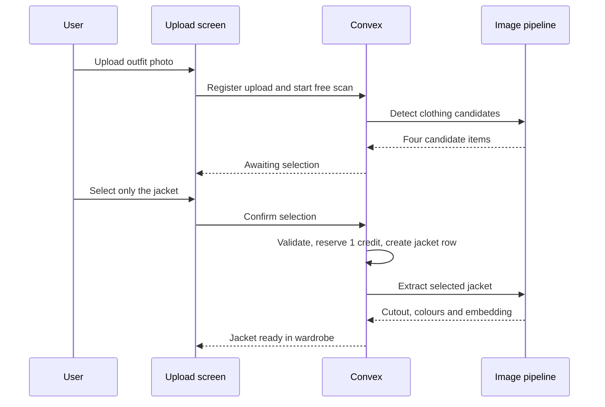

### 4. Extract, describe and index

`extractItem` sends the source photo and the selected item’s description to **`gpt-image-2`**. It generates a **1024 × 1024** product-style image, requesting a transparent background with an opaque fallback for unsupported transparency requests.

The app then:

1. Stores the generated PNG in Convex file storage.
2. Reads dominant colour swatches from its pixels.
3. Embeds its description and attributes with **`text-embedding-3-small`**.
4. Searches the user’s existing item vectors for likely duplicates.
5. Marks the piece ready and updates the job.

The **1536-dimensional embeddings live in a separate table**, keeping wardrobe list reads small. Duplicate detection is scoped to the user and uses a configured similarity threshold of `0.92`. A likely duplicate is flagged, not silently merged or deleted. The ordinary wardrobe search/filter UI is separate from this duplicate check.

Extraction runs in chunks of up to four pieces per photo. Workflow completion settles failures and refunds unused reservations. Re-extraction keeps an existing ready item visible until its replacement succeeds.

**Read the code:** [`convex/uploads.ts`](convex/uploads.ts) · [`convex/model/uploads.ts`](convex/model/uploads.ts) · [`convex/workflows/ingest.ts`](convex/workflows/ingest.ts) · [`convex/ai/openai.ts`](convex/ai/openai.ts).

---

<a id="try-ons"></a>

## 🪞 How Virtual Try-Ons Work

### The input is a person plus individual garments

A render uses the selected avatar first, followed by the outfit’s garment cutouts as image references. The prompt explains the garment order, requested fit and styling, and asks the model to preserve the person’s identity and natural body proportions.

Both qualities create **1024 × 1536** images:

| App quality | Model quality | Credit cost per image |
| ----------- | ------------- | --------------------- |
| Standard    | `medium`      | 1                     |
| HQ          | `high`        | 3; requires Plus      |

HQ changes the model’s quality setting, not the requested dimensions. The implementation uses `gpt-image-2` image edits and does **not** send `input_fidelity`.

If the outfit leaves a core slot empty, the prompt explicitly supplies a neutral fallback: a plain top, dark trousers or white trainers. These generated fallback clothes are not added to your wardrobe. Include the actual pieces if you need a render to reflect a complete owned outfit.

### Normalize image bytes before calling the provider

A file can have a `.jpg` name and still contain image modes or auxiliary data the image API rejects. [`normalizeImageInput`](convex/ai/image_input.ts) decodes the bytes with Sharp, checks the format and pixel limits, applies orientation, constrains the longest edge to 2048 pixels and produces an sRGB PNG.

This also handles the primary image in supported iPhone JPEGs with auxiliary HDR gain maps. Empty, unreadable, multi-frame and unsupported images receive a human-readable error. The input pixel ceiling is 50 megapixels. Renaming a HEIC file to `.jpg` does not make it supported.

### Reserve once, render in the background, settle the result

The backend validates the avatar, outfit ownership, plan, daily allowance and concurrent-job limit before reserving credits. It creates the job and render records, then starts the durable workflow.

Transient action failures use the workflow’s retry policy: up to **3 attempts**, starting with a **2-second** backoff. The OpenAI SDK’s own automatic retries are disabled so retries stay under workflow control. Permanent invalid-input/provider request failures settle without repeatedly submitting the same rejected image.

The completion callback counts successful outputs, marks unfinished renders failed and refunds the corresponding unused credits. A job with mixed results becomes `partial`; a job with no successful image becomes `failed`. The card shows the stored outcome even if the original chat response has finished.

**Read the code:** [`convex/model/renders.ts`](convex/model/renders.ts) · [`convex/workflows/render.ts`](convex/workflows/render.ts) · [`convex/ai/prompts.ts`](convex/ai/prompts.ts) · [`src/components/common/job-progress.ts`](src/components/common/job-progress.ts).

---

<a id="stylist"></a>

## 🧠 The Contextual AI Stylist

### A model with a small set of product tools

[`agent/agent.ts`](agent/agent.ts) configures **`openai/gpt-5.4-mini`** through Vercel AI Gateway. Eve discovers the tool files in `agent/tools/`. General-purpose sandbox, shell and file tools are disabled; this agent has focused wardrobe capabilities.

| Tool              | What it does                                                           |
| ----------------- | ---------------------------------------------------------------------- |
| `get_context`     | Reads styling preferences, avatar count and current credits            |
| `get_wardrobe`    | Lists owned ready pieces, optionally filtered by category or season    |
| `get_weather`     | Uses Open-Meteo geocoding and forecast data for a specified place/date |
| `gap_analysis`    | Reports wardrobe coverage and concrete missing categories              |
| `load_skill`      | Loads the supplied colour-pairing or dress-code guidance when useful   |
| `ask_question`    | Presents a focused clarification with selectable answers               |
| `compose_outfits` | Validates item IDs and slots, then creates outfit proposals            |
| `save_outfit`     | Adds a proposal to the saved outfit collection                         |
| `quote_renders`   | Calculates cost and checks blockers without starting generation        |
| `start_renders`   | Requires user approval, then starts the authenticated render workflow  |

The agent is instructed to check the wardrobe before recommending garments, explain gaps honestly and ask a question only when the answer changes the outfit. Open-Meteo is called without an API key in this implementation; check its usage terms for your deployment.

### Page context makes “this jacket” meaningful

The frontend can attach a structured, one-turn snapshot of the current page: an item, selected pieces or an outfit draft. You can exclude page context for a turn.

This is **application data, not unrestricted access to the browser**. It is marked untrusted and may be stale. It does not grant permission, prove ownership or authorize credit spending. The agent still verifies exact items through its tools. Unsaved outfit choices are marked as drafts so they are not confused with the saved outfit on the server.

### Approval is part of execution

A render request follows this sequence:

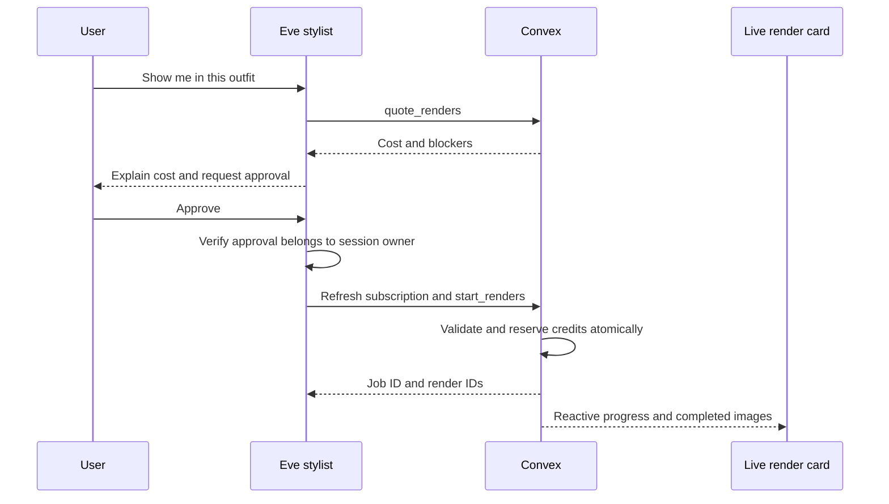

The quote is not a reservation. Conditions are checked again when execution starts, including the current subscription. An approval from a different principal is rejected.

### Authentication continues beyond the first message

The Eve channel verifies the browser’s Clerk bearer token. Session creation requires an owned Fitcheck thread; the server binds the new Eve session to that thread before exposing the session ID. Subsequent session operations check the same ownership binding.

Tools use an internal service key plus the Clerk user ID derived from the authenticated session. The model does not get to supply a different user identity. Local development impersonation is an explicit opt-in and never replaces a rejected bearer token.

### The chat reflects live work

Grouped tool activity distinguishes working, completed, failed, cancelled, paused and waiting states. Questions and approvals stay interactive. The transcript follows incoming content only while you are near the bottom; moving up to read history does not force you back down.

Render cards subscribe to Convex after the tool returns. This is why a finished image can correctly say **Complete** even though the language-model turn ended earlier. The instructions avoid a permanent “It’s running” message that becomes false when the job finishes.

**Read the code:** [`agent/instructions.md`](agent/instructions.md) · [`agent/channels/eve.ts`](agent/channels/eve.ts) · [`agent/tools/start_renders.ts`](agent/tools/start_renders.ts) · [`src/components/stylist`](src/components/stylist).

---

<a id="auth-and-credits"></a>

## 🔐 Authentication, Subscriptions and Credits

### Clerk is the subscription source of truth

The app uses Clerk for sign-in and user-level Billing. Next.js protects signed-in routes, and `ConvexProviderWithClerk` supplies the token used by Convex. Queries wait for Convex authentication before running.

`subscriptions.refresh` reads the active subscription through the **Clerk Backend SDK**. Refreshes happen around sign-in, app focus, billing changes and operations that spend credits or require paid access. Convex keeps a bounded, SDK-derived snapshot for transactional authorization; it rejects stale paid privileges and prevents older reads from replacing newer results.

**Clerk Billing handles all paid plans.** The app has no standalone credit-pack checkout or custom payment webhooks; subscription state comes directly from the Clerk SDK.

### Plans and allowances

These are the build’s configured defaults in [`convex/shared/credits.ts`](convex/shared/credits.ts). Configure matching monthly user plans in your own Clerk instance. Clerk’s pricing table displays the prices actually configured there.

| Plan | Reference monthly price | Included credits                | Avatar limit | Additional access                               |
| ---- | ----------------------- | ------------------------------- | ------------ | ----------------------------------------------- |
| Free | $0                      | 25 once at signup               | 1            | Wardrobe, builder, stylist and standard try-ons |
| Pro  | $9.99                   | 150 per verified billing period | 2            | Public render sharing                           |
| Plus | $19.99                  | 300 per verified billing period | 5            | Sharing and HQ try-ons                          |

There is no plan-based priority queue in the current implementation.

### What consumes credits?

| Operation                                                 | User credit charge |
| --------------------------------------------------------- | ------------------ |
| Scan a photo and review its candidates                    | 0                  |
| Import/extract one selected piece                         | 1                  |
| Generate one standard try-on                              | 1                  |
| Generate one HQ try-on                                    | 3                  |
| Ask the stylist, check weather, compose or save an outfit | 0                  |
| Seed the demo wardrobe                                    | 0                  |

For example: select two pieces from one photo, then render one standard outfit twice. The total is **2 extraction credits + 2 render credits = 4 credits**. Scanning the other unwanted pieces does not add to that charge.

Text-only operations still consume provider resources and have rate limits. Defaults include **200 detection calls** and **100 stylist messages** per user per UTC day, a **150-credit daily cap**, and **3 concurrent work units** per user. An upload batch counts as one unit; each render job counts as one. The workflow worker pool has global parallelism of 8.

### Two balances and one ledger

- `planCredits` are the current billing-period allowance.
- The interface calls the second balance **Non-expiring credits**: the signup bonus and any existing credits stay available. The stored field remains `packCredits` for compatibility.
- Reservations spend plan credits first.
- Refunds restore the non-expiring part first, within what was reserved.
- Plan credits are excluded while the current subscription period is expired.
- Grants, reservations and refunds use stable references to prevent duplicate ledger effects. Existing purchase history remains readable through the legacy `topup` ledger kind.

Only [`convex/model/credits.ts`](convex/model/credits.ts) writes balances or the credit ledger. Plan grants are keyed by the verified Clerk billing period. Repeated SDK refreshes cannot repeatedly grant that period’s credits.

**Current limitation:** reservations do not retain their originating billing period. A late plan-credit refund writes to the current plan bucket, so a job spanning a renewal can restore credits into the new period. Period-bound refunds need additional handling before treating that boundary as a strict accounting guarantee.

### Getting more credits

Open **Billing** to choose or manage a recurring Clerk plan. Pro and Plus provide a fresh allowance each verified billing period; Free includes the one-time signup bonus. The app does not sell one-off packs.

Existing non-expiring credits and ledger entries are preserved. Changing a plan does not remove those credits. Clerk test-mode checkout can verify the subscription flow during development; it is not evidence of a live payment.

### Ownership and deletion

Public Convex functions resolve the authenticated user and scope records to that user; access by document ID also checks ownership. Service calls validate the service key and caller identity. Admin operations require both the stored role and the current verified Clerk role claim.

**Delete all data** removes wardrobe content, files, outfits, renders and conversations in batches. It keeps the account, plan, credit balance and ledger, including the one-time signup-credit record. It does not delete the Clerk account. Free users can replace their only avatar without deleting it first; replacement preserves its identity and default selection and waits for pending renders using the old image.

---

<a id="data-and-routes"></a>

## 🗃️ Database and Routes

### Data model

| Table                             | Purpose                                                                     |
| --------------------------------- | --------------------------------------------------------------------------- |
| `users`                           | Clerk identity mapping, preferences, role and SDK-derived plan/credit state |
| `avatars`                         | Owned personal photos and default-avatar choice                             |
| `uploads`                         | Original photos, detected candidates, selection and import state            |
| `items`                           | Clothing attributes, cutout references, wear history and processing state   |
| `itemEmbeddings`                  | User-scoped vectors for duplicate detection                                 |
| `outfits`                         | Named slot compositions, proposals, saved state and wear dates              |
| `renders`                         | Try-on outputs, quality, status, usage and optional share token             |
| `jobs`                            | Workflow steps, reservations, refunds, outcome and result references        |
| `creditLedger`                    | Idempotent grants, spending, refunds and existing purchase history                           |
| `threads`                         | Owned stylist threads and verified Eve session bindings                     |
| `proposals`                       | Links between stylist conversations, outfits and render jobs                |
| `systemCounters`, `usageCounters` | Global accounting and per-user daily limits                                 |
| `dailyStats`, `stepStats`         | Operational aggregates and historical step durations                        |

The full schema and indexes are in [`convex/schema.ts`](convex/schema.ts). Business logic lives in `convex/model/`; public query/mutation/action wrappers validate inputs and enforce access.

### Route map

| Route                                             | Screen                                                    |
| ------------------------------------------------- | --------------------------------------------------------- |
| `/`                                               | Public landing page; signed-in users go to their wardrobe |
| `/sign-in`, `/sign-up`                            | Clerk authentication                                      |
| `/onboarding`                                     | Personal photo, wardrobe choice and initial preferences   |
| `/wardrobe`, `/wardrobe/[itemId]`                 | Wardrobe and item editor                                  |
| `/add`                                            | Uploads, scans and import review                          |
| `/outfits`, `/outfits/new`, `/outfits/[outfitId]` | Saved outfits and the outfit studio                       |
| `/stylist`, `/stylist/[threadId]`                 | Conversation list and standalone stylist                  |
| `/lookbook`                                       | Generated try-ons                                         |
| `/billing`                                        | Clerk plans, balance and ledger                    |
| `/settings`                                       | Preferences, avatars and data controls                    |
| `/share/[token]`                                  | Publicly shared render                                    |
| `/admin`                                          | Authorized operational dashboard                          |

The global stylist panel also works across the signed-in routes.

---

<a id="getting-started"></a>

## 🏁 Getting Started

### 1. Open the project and install

Clone the repository, or use **Code → Download ZIP**:

```bash
git clone https://github.com/sonnysangha/AI-Wardrobe-app-vercel-eve-clerk-nextjs.git
cd AI-Wardrobe-app-vercel-eve-clerk-nextjs
```

Install Node **24 or newer** and pnpm **10.28.0**. With nvm available, `.nvmrc` selects the project’s Node version:

```bash
nvm use
npm install -g pnpm@10.28.0
pnpm install --frozen-lockfile
cp .env.example .env.local
```

Copy the example only on first setup; do not overwrite an existing `.env.local`. This guide uses your own resources and does not require the demo operator’s deployment files.

### 2. Create Clerk and enable its Convex integration

1. [Create a Clerk application](https://go.clerk.com/sonny) and choose your sign-in methods.
2. Add its publishable and secret keys to the corresponding fields in `.env.local`.
3. Activate Clerk’s **Convex integration**. This checkout requests the `convex` token; confirm the token/template has audience `convex`.
4. Copy the app’s exact Frontend API/issuer URL, such as `https://your-app.clerk.accounts.dev`.

The publishable key, secret key and issuer must belong to the **same Clerk instance**. Keep the `/sign-in`, `/sign-up`, `/wardrobe` and `/onboarding` redirect settings supplied in [`.env.example`](.env.example).

The installed integration is in [`src/components/providers`](src/components/providers) and [`convex/auth.config.ts`](convex/auth.config.ts). See the [official Convex–Clerk guide](https://docs.convex.dev/auth/clerk) for the current dashboard flow.

### 3. Link your Convex development deployment

```bash
pnpm exec convex dev --configure
```

Sign in and create or select your own project. The CLI writes `CONVEX_DEPLOYMENT` and `NEXT_PUBLIC_CONVEX_URL` to `.env.local`.

**The first function push needs `CLERK_JWT_ISSUER_DOMAIN`.** If it pauses or fails because that variable is missing, the project can still be linked. Set the variable on that development deployment in the Convex dashboard, or use another terminal:

```bash
pnpm exec convex env set CLERK_JWT_ISSUER_DOMAIN https://your-app.clerk.accounts.dev
```

Use the real URL from step 2, then rerun `pnpm exec convex dev` if necessary. Never leave an example issuer configured: the browser may sign in successfully while Convex rejects every authenticated request.

For a temporary local-only backend without a Convex account, the alternative is `CONVEX_AGENT_MODE=anonymous pnpm exec convex dev`. Its data lives locally. It is not a cloud deployment, and a hosted Vercel app cannot use its `127.0.0.1` URL.

### 4. Set the agent and AI credentials

Generate an app-internal service key locally:

```bash
openssl rand -hex 32
```

Store it privately as `AGENT_SERVICE_KEY` in **both** `.env.local` and your Convex deployment. It authorizes the Eve service to call the app’s scoped agent functions.

For local Eve development, add `AI_GATEWAY_API_KEY` to `.env.local`. For Convex AI actions, choose one provider configuration:

- Set `AI_GATEWAY_API_KEY` on Convex to route detection, images and embeddings through Gateway; or
- Set `OPENAI_API_KEY` on Convex for direct OpenAI access.

When both are present, the image pipeline prefers the direct OpenAI key. This is configuration-based selection, not automatic failover after a failed provider request. The stylist still uses AI Gateway.

Set Convex’s `CLERK_SECRET_KEY` to the same Clerk instance’s secret, and configure:

```bash
pnpm exec convex env set SITE_URL http://localhost:3000
pnpm exec convex env set MAX_DAILY_SPEND_USD 50
```

Use the Convex dashboard for secret values, or `pnpm exec convex env set NAME VALUE` in your private terminal. Adding a secret only to `.env.local` does **not** make it available to Convex actions. Model access and provider balance must also be available for the configured models.

### 5. Configure Clerk Billing

Enable **user Billing** in the same Clerk application. Create the monthly plans and feature slugs the code expects:

| Plan slug | Monthly reference price | Features                |
| --------- | ----------------------- | ----------------------- |
| `pro`     | $9.99                   | `sharing`               |
| `plus`    | $19.99                  | `sharing`, `hq_renders` |

Keep free users on the free tier. The app supplies the one-time 25-credit signup bonus and the plan allowances defined in `convex/shared/credits.ts`; these are not Clerk metered-usage products.

Use Clerk’s development/test checkout while building. The app reads subscriptions through the SDK—**do not add a Clerk subscription webhook or a Clerk webhook signing secret**.

For optional admin access, include `public_metadata: "{{user.public_metadata}}"` in the verified Convex token template and deliberately set the intended user’s `publicMetadata.role` to `admin`. Refresh that user’s session. Unknown or absent roles remain ordinary users; do not grant admin access just to complete onboarding.

### 6. Run both development processes

```bash
# Terminal 1 — database, functions and workflows
pnpm convex:dev
```

```bash
# Terminal 2 — Next.js and the Eve stylist
pnpm dev
```

Open [http://localhost:3000](http://localhost:3000). `withEve` starts the development agent beside Next.js and exposes it at `/eve/v1/*`; you do not need a separately launched agent for ordinary app use.

Sign up, upload a supported personal photo, select men’s or women’s wardrobe and finish onboarding. Use **Seed demo wardrobe** for a quick first outfit. Seeding is free; rendering those pieces still consumes normal credits.

### Environment reference

| Variable                            | Next.js / Eve (`.env.local`, then Vercel)                                     | Convex deployment                                        |
| ----------------------------------- | ----------------------------------------------------------------------------- | -------------------------------------------------------- |
| `NEXT_PUBLIC_CONVEX_URL`            | Required; the intended backend URL, also read by agent tools                  | —                                                        |
| `CONVEX_DEPLOYMENT`                 | Local CLI selector written by Convex                                          | —                                                        |
| `NEXT_PUBLIC_CLERK_PUBLISHABLE_KEY` | Required; public Clerk instance identifier                                    | —                                                        |
| `CLERK_SECRET_KEY`                  | Required for server/Eve authentication                                        | Required for subscription SDK reads                      |
| `CLERK_JWT_ISSUER_DOMAIN`           | —                                                                             | Required; exact Clerk issuer URL                         |
| `NEXT_PUBLIC_CLERK_*_URL` settings  | Keep the routes provided in `.env.example`                                    | —                                                        |
| `AI_GATEWAY_API_KEY`                | Stylist credentials locally; hosted Eve can use Vercel OIDC                   | Required for AI actions unless using `OPENAI_API_KEY`    |
| `OPENAI_API_KEY`                    | Not used by the stylist configuration                                         | Optional direct provider; takes precedence over Gateway  |
| `AGENT_SERVICE_KEY`                 | Required; keep server-side                                                    | Required; must match Eve                                 |
| `SITE_URL`                          | Optional allowed-origin restriction for Eve token verification                | Required for demo wardrobe images; use the frontend origin |
| `MAX_DAILY_SPEND_USD`               | —                                                                             | Operator spend guard; set explicitly                     |
| `AGENT_DEV_CLERK_USER_ID`           | Optional explicit local `eve dev` identity; unnecessary for signed-in app use | —                                                        |
| `ALLOW_DEV_SMOKE`                   | —                                                                             | Scratch deployments only; enables internal smoke helpers |

Hosted Eve can use Vercel OIDC, but **Convex is a separate runtime and still needs an explicit AI key**. See [AI Gateway authentication](https://vercel.com/docs/ai-gateway/authentication-and-byok). Never put server secrets in variables prefixed `NEXT_PUBLIC_`.

### First-run checklist

- [ ] Convex functions push successfully with the actual Clerk issuer.
- [ ] Signing in reaches onboarding, then the wardrobe without token errors.
- [ ] A new account receives its one-time signup credits.
- [ ] Demo seeding asks for men’s or women’s pieces and populates the wardrobe.
- [ ] A free scan pauses for selection rather than importing everything.
- [ ] One selected import produces one ready item and the expected charge.
- [ ] A standard try-on finishes and appears in the Lookbook.
- [ ] The stylist reads the current wardrobe and asks for approval before rendering.
- [ ] Plan refresh reads Clerk successfully and grants each verified billing period only once.

---

<a id="demo-walkthrough"></a>

## 🎬 Demo Walkthrough

| Step | What to do                                                       | What it demonstrates                                                |
| ---- | ---------------------------------------------------------------- | ------------------------------------------------------------------- |
| 1    | Sign in and complete photo/wardrobe preferences                  | Clerk identity and onboarding                                       |
| 2    | Seed the men’s or women’s demo wardrobe                          | Useful first-run data without an AI charge                          |
| 3    | Upload a photo containing several garments                       | A real free vision scan                                             |
| 4    | Choose just one garment and confirm its credit quote             | Human selection before paid extraction                              |
| 5    | Open the new piece and correct an attribute                      | Editable model output                                               |
| 6    | Create an outfit and choose its pieces                           | Structured composition from owned items                             |
| 7    | Open Ask stylist and ask “How could I dress this up for dinner?” | Contextual tools and grounded recommendations                       |
| 8    | Ask “Show me wearing it” and approve the displayed cost          | Quote, approval and durable generation                              |
| 9    | Navigate away while it renders, then open Activity/Lookbook      | Realtime progress independent of the current page                   |
| 10   | Inspect Billing                                                  | Clerk plans, credit allowances, spending and refunds |

Choose your own or permitted photos. A clear, complete personal photo gives the renderer more useful proportions than a tightly cropped portrait. Results can vary; use the actual generated result in a demonstration rather than promising a particular image.

---

<a id="verification"></a>

## 🧪 Testing and Verification

### Local checks

```bash
pnpm test
pnpm typecheck
pnpm lint
```

`pnpm test` uses Node’s test runner over `tests/*.test.mjs`. It includes focused regression coverage for image-input normalization, credit accounting and subscription behavior, auth/session boundaries, imports, render settlement, progress states, chat tools, upload recovery and item-form updates. The suite does not require a paid image generation or checkout.

`pnpm typecheck` generates Next route types and checks the app, Convex and agent TypeScript projects.

### Optional backend smoke checks

The internal helpers in [`convex/dev/smoke.ts`](convex/dev/smoke.ts) require `ALLOW_DEV_SMOKE=1` on a **scratch deployment**. With that explicitly configured:

```bash
pnpm exec convex run dev/smoke:runRegressions '{}'
```

That deterministic helper checks credit idempotency, SDK snapshot ordering/expiry, avatar replacement and batched content deletion, then removes its fixtures and restores aggregate counters. Other pipeline helpers in the same file make real AI calls and spend provider funds. Do not enable the smoke switch on production.

### Recorded verification

On **17 September 2026**, the completed audit recorded:

- **144 tests passed** in the latest Clerk-only billing release, with TypeScript, ESLint and diff checks passing. The suite includes regression coverage for preserved credits, subscription renewals and refunds.
- Successful Convex deployment and Vercel production build, including the Eve service.
- Responsive browser checks at **320, 390, 768 and 1440 pixels**, with light and dark themes.
- A real scan, jacket-only import, outfit save and completed standard try-on on a local QA account.
- Hosted wardrobe and stylist checks, including completed real tool calls.
- A successful hosted Eve health response.

These are dated observations, not a promise about future model output or service availability. Physical iPhone/Safari, native software-keyboard behavior, real payments, account deletion and public sharing were not exercised in that mobile audit. Sign-in/signup, onboarding and global recovery routes received a source review rather than a fresh end-to-end account lifecycle during that pass.

Screenshot assets intended for this README are documented in [docs/assets/README.md](docs/assets/README.md). Run the checks above against your own checkout and service configuration.

---

<a id="deployment"></a>

## 🚀 Deployment

### 1. Prepare your cloud services

Use your own Convex production deployment and Vercel project. Configure the production Convex variables from the table above, including its Clerk issuer, Clerk secret, matching agent service key and explicit AI credentials.

For a public launch with live Clerk authentication, configure Clerk’s production instance on an owned custom domain. Keep its publishable key, secret key and issuer together; a development-instance demo is not a completed live-auth rollout. Set up and verify live billing separately before collecting money.

### 2. Deploy Convex explicitly

With the CLI linked to your own intended Convex project:

```bash
pnpm exec convex deploy
```

Check the deployment target shown by the CLI. This project’s Vercel build command does **not** deploy Convex automatically. If you use separate local and cloud configurations, select the correct environment with the Convex CLI rather than overwriting a working local development file.

### 3. Configure Vercel and deploy the app

Set the Next.js/Eve environment variables on your Vercel project. `NEXT_PUBLIC_CONVEX_URL` must point to the cloud deployment, and `AGENT_SERVICE_KEY` must match that deployment’s value. Configure Gateway access for Eve and use Node 24 or newer.

```bash
vercel link
vercel deploy --prod
```

[`vercel.json`](vercel.json) selects the verified `pnpm exec next build --webpack` command. [`next.config.ts`](next.config.ts) uses `withEve`, which emits the deployed agent service alongside the frontend. Keep those integrations when changing the build configuration.

### 4. Verify the hosted path

- Open `/eve/v1/health` on your frontend origin and verify the service is healthy.
- Sign in and confirm Convex accepts the Clerk token.
- Seed or upload test pieces, complete one import and one try-on, and check the ledger.
- Ask the stylist to inspect an owned item; confirm real tool activity and its answer.
- Verify subscription changes through Clerk and check the resulting allowance in the ledger.

Local Convex data is not automatically present in the cloud. Likewise, copying Convex thread rows does not migrate historical local Eve transcripts into Vercel’s runtime. Use fresh hosted conversations when checking a deployment.

### Local production mode

For a local production build with the built Eve server:

```bash
pnpm exec eve build
pnpm build
pnpm start
```

Eve’s built server normally uses port 4274. Optional `EVE_NEXT_PRODUCTION_ORIGIN` / `EVE_NEXT_PRODUCTION_PORT` settings are documented in `.env.example`. This path is separate from the Vercel service build.

---

<a id="troubleshooting"></a>

## 🐛 Troubleshooting

| Symptom                                                 | What to check                                                                                                                                                                              |
| ------------------------------------------------------- | ------------------------------------------------------------------------------------------------------------------------------------------------------------------------------------------ |
| “No auth provider found matching the given token”       | Confirm Convex’s `CLERK_JWT_ISSUER_DOMAIN` is the actual Clerk issuer, not an example. Verify audience `convex`, matching app keys, and push the auth config again.                        |
| Clerk says signed in but Convex queries fail            | Wait for `useConvexAuth().isAuthenticated`; a loaded Clerk session alone does not prove Convex has accepted its token. Existing hooks use the literal `"skip"` while waiting.              |
| First Convex push reports a missing issuer              | Finish linking the deployment, set `CLERK_JWT_ISSUER_DOMAIN` there, then retry the push. A value only in the Next env file does not configure the backend.                                 |
| `pnpm dev` fails in the Eve runtime                     | Check Node 24+, install with the pinned pnpm version and inspect the Next/Eve terminal output.                                                                                             |
| Chat UI opens but tools fail                            | Check the Eve backend URL, identical `AGENT_SERVICE_KEY` values and Clerk identity. A healthy frontend alone does not prove the agent can call Convex.                                     |
| Hosted chat works but image actions have no credentials | Set `OPENAI_API_KEY` or `AI_GATEWAY_API_KEY` on Convex. Eve’s Vercel OIDC does not supply credentials to Convex.                                                                           |
| “Invalid image file or mode”                            | Use a valid still JPEG/PNG/WebP. Current image actions normalize actual bytes before sending them. Re-upload a damaged file; changing its extension will not convert it.                   |
| A phone photo is rejected                               | HEIC and multi-frame images are unsupported. Export a JPEG/PNG/WebP, or use the phone’s compatible JPEG capture option.                                                                    |
| Scan finishes but nothing appears in the wardrobe       | Open the photo’s review and select the pieces to import. The free scan intentionally stops before extraction.                                                                              |
| Import waits for credits                                | Check both total balance and today’s allowance. A plan change does not bypass the daily cap. Resume only the remaining selected pieces when credits are available.                                                            |
| A render is still active                                | Inspect actual steps and retries in Activity. Historical duration guidance is not a deadline; provider latency varies.                                                                     |
| The try-on includes a garment you did not select        | Empty core slots can receive neutral prompt fallbacks. Populate the outfit’s top/bottom/shoes if you need those specific pieces represented.                                               |
| Head size or body proportions look wrong                | Use a clear, uncropped personal photo. Prompts request natural proportions, but generative results can still vary. Compare another render rather than treating a preview as a measurement. |
| A plan changed but credits did not                      | Use Billing’s refresh, check the Clerk SDK secret, correct plan slugs and the verified billing period. Do not add a subscription-sync webhook.                                             |
| An old local conversation cannot be restored on Vercel  | Local and hosted Eve runtimes have different transcript storage. Start a hosted conversation; importing Convex records alone is insufficient.                                              |
| `next start` cannot reach Eve                           | Run `pnpm exec eve build` before the local production build, then check the configured production origin/port.                                                                             |

---

<a id="take-it-further"></a>

## 🏆 Take It Further

Ideas for extending this build, rather than claims about existing features:

- **A clothing calendar:** plan outfits for specific dates and reuse wear history.
- **Packing lists:** turn trip dates, forecasts and owned pieces into a capsule wardrobe.
- **Better import correction:** let a user refine the selected garment’s region before extraction.
- **Render comparison:** compare prompt versions and identity/garment fidelity against a permitted evaluation set.
- **Accessibility/device coverage:** add automated route flows and physical mobile Safari checks.
- **Operational alerts:** notify operators about sustained provider failures, queue pressure and unusual credit spend.
- **More import sources:** add supported retailer integrations with explicit import selection and permission-aware media handling.

---

<a id="quick-reference"></a>

## 📋 Quick Reference

### Commands

| Command                     | Purpose                                                  |
| --------------------------- | -------------------------------------------------------- |
| `pnpm dev`                  | Next.js plus the development Eve service                 |
| `pnpm convex:dev`           | Watch and push backend functions/schema                  |
| `pnpm convex:codegen`       | Regenerate the Convex API/types                          |
| `pnpm test`                 | Focused Node regression suite                            |
| `pnpm typecheck`            | Next route generation, app, Convex and agent type checks |
| `pnpm lint`                 | ESLint                                                   |
| `pnpm format:check`         | Check formatting                                         |
| `pnpm format`               | Format the repository; review the resulting changes      |
| `pnpm build` / `pnpm start` | Local production app; build Eve first                    |
| `pnpm exec convex deploy`   | Deploy backend code to the selected production project   |
| `vercel deploy --prod`      | Deploy Next.js and Eve to the linked Vercel project      |

### Repository map

```text
agent/
  agent.ts                  Stylist model configuration
  instructions.md           Persona, grounding and spending rules
  channels/eve.ts           Clerk token and session ownership checks
  tools/                    Wardrobe, weather, proposals, quotes and renders
  skills/                   Colour pairing and dress-code guidance
convex/
  schema.ts                 Tables and indexes
  shared/                   Credit rules, vocabulary and validators
  lib/                      Auth, environment and error helpers
  model/                    Database and credit business logic
  ai/                       Detection, image normalization, prompts and edits
  workflows/                Durable scans, extraction and try-ons
  subscriptions.ts          Clerk Backend SDK subscription reads
src/
  app/                      Next.js App Router pages
  components/               Feature screens and shared UI
  hooks/                    Authenticated queries and product interactions
  lib/                      Environment, formatting and page context
  proxy.ts                  Clerk middleware entry point
public/
  demo-wardrobe/            Adult demo garment assets
  landing/                  Editorial landing assets
/tests                      Regression coverage
/docs/assets                README screenshots and provenance
/docs/reference             Vendored Convex references
```

### Useful entry points

| File                                                                                         | Start here to understand                                     |
| -------------------------------------------------------------------------------------------- | ------------------------------------------------------------ |
| [`PLAN.md`](PLAN.md)                                                                         | Routes, schema, credit rules and the implementation contract |
| [`AGENTS.md`](AGENTS.md)                                                                     | Repository conventions and installed-version caveats         |
| [`DESIGN.md`](DESIGN.md)                                                                     | Visual direction                                             |
| [`.env.example`](.env.example)                                                               | Environment ownership and optional switches                  |
| [`convex/shared/credits.ts`](convex/shared/credits.ts)                                       | Plans, limits and credit-cost calculations                |
| [`convex/model/credits.ts`](convex/model/credits.ts)                                         | Reservation, refund and ledger behavior                      |
| [`convex/subscriptions.ts`](convex/subscriptions.ts)                                         | SDK-derived subscription state                               |
| [`convex/workflows/manager.ts`](convex/workflows/manager.ts)                                 | Retry and concurrency configuration                          |
| [`convex/ai/openai.ts`](convex/ai/openai.ts)                                                 | Provider calls and output handling                           |
| [`convex/ai/image_input.ts`](convex/ai/image_input.ts)                                       | Input decoding and normalization                             |
| [`src/components/stylist/stylist-provider.tsx`](src/components/stylist/stylist-provider.tsx) | Global stylist state                                         |
| [`src/lib/stylist-context.ts`](src/lib/stylist-context.ts)                                   | Attached page-context contract                               |

## 📜 Attribution and Use

This is an educational application. Third-party packages and services retain their own terms and licenses; inspect the relevant licenses before redistributing assets or shipping a derivative. This README does not grant rights to third-party photographs or garments.

Use photos you own or have permission to process. Personal photos, garment references and prompts are sent to the configured AI services for the requested operations. The demo catalog and editorial assets illustrate the product; they are not a retailer inventory or a sizing guarantee.

Keep environment files, service credentials and private QA material out of published repositories. The README screenshots have their own [capture notes](docs/assets/README.md).

Built by [Sonny Sangha](https://github.com/sonnysangha). **[Get started with Clerk →](https://go.clerk.com/sonny)** · **[Join the free AI Community →](https://www.papareact.com/ztoh-form)**
